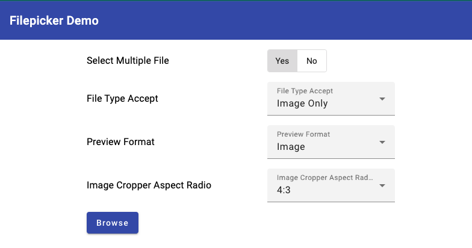
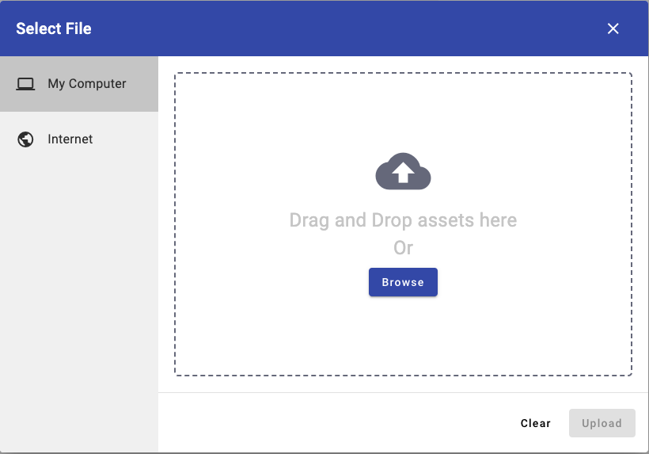
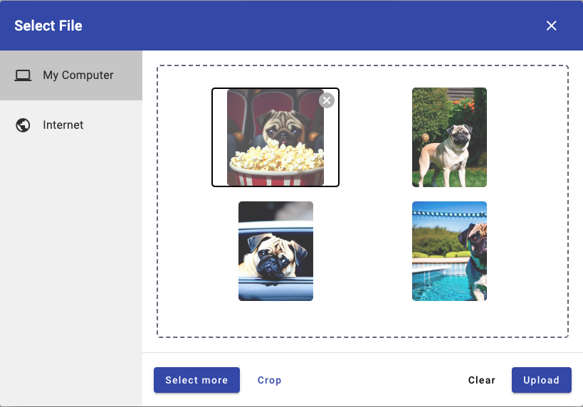
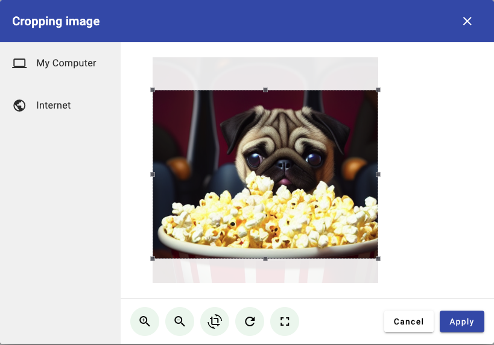
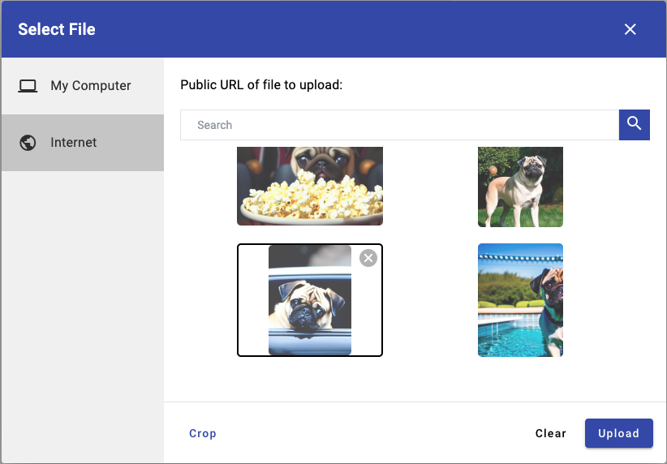
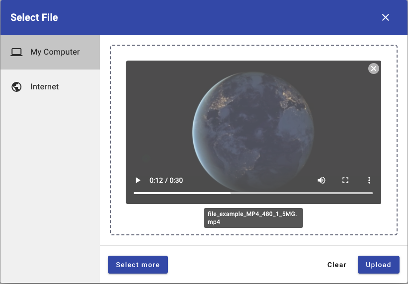
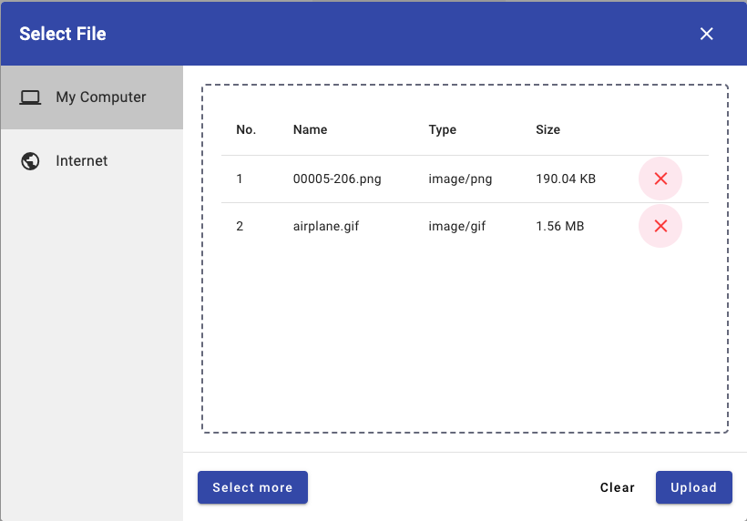

# AngularFilepicker

A highly customizable Angular file picker with image cropper.

## Screenshot

## Component documentation
This component has the following Input properties:
* `multiple`: Allow the selection of multiple files at once. Defaults to true.
* `fileAccept`: Set the accepted file types (as for a native file element). Defaults to `*`. Example: `image/png, image/gif ,video/*`.
* `previewImage`: Allow preview image and open image cropper function when all selected files are in image format. Defaults to true.
* `previewImage`: Allow preview video when all selected files are in video format. Defaults to true.
* `aspectRatio`: The width / height ratio (e.g. 1/1 for a square, 4/3, 16/9 ...). Defaults to 4/3;

## Built with
* [Angular](https://angular.io/)
* [Angular Material](https://material.angular.io/)
* [ngx-dropzone](https://www.npmjs.com/package/ngx-dropzone)
* [ngx-image-cropper](https://www.npmjs.com/package/ngx-image-cropper)
* [TailwindCSS](https://tailwindcss.com/)

## Development server

Run `ng serve` for a dev server. Navigate to `http://localhost:4200/`. The application will automatically reload if you change any of the source files.